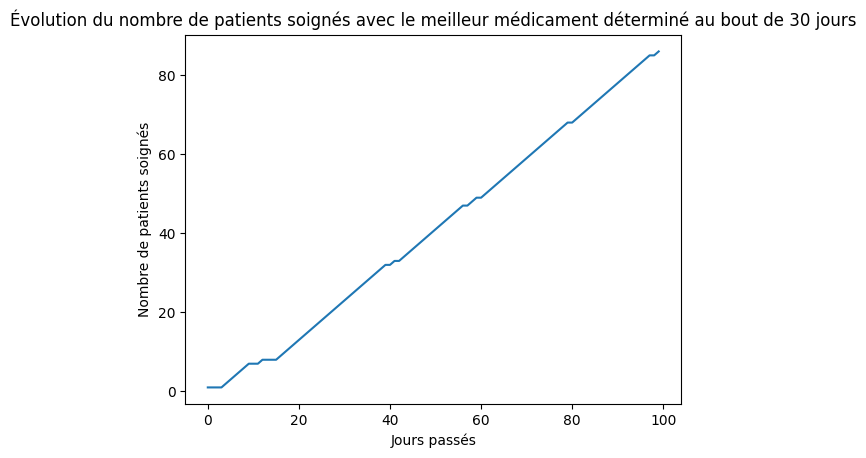
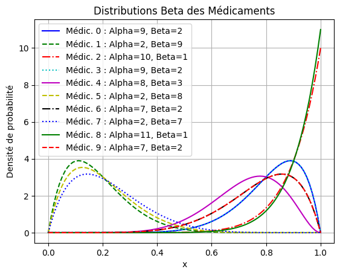
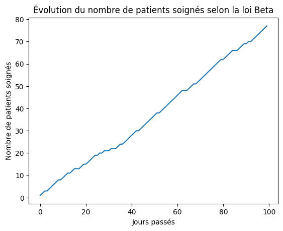

# Projet Médicament

## Présentation du projet :

Pendant une expérience de 100 jours,  un soignant donne des médicaments à des patients, il a dix types de médicament différent avec un pourcentage de réussite définis pour chacun.  

## Problème - Un système de renforcement par apprentissage

Le soignant ne connaissent pas les pourcentages de réussite des médicaments. Ainsi, le soignant doit évaluer le succès de chaque médicament en fonction du retour qu'il a des patients. Il peut supposer un pourcentage de réussite pour chaque médicament. Il détermine alors le médicament qui va être donné ensuite au patient. Le but est pour le soignant de trouver le(s) médicament(s) le(s) plus efficace(s) pour soigner le plus de patients possible. Durant l'expérience, il faudra, pour maximiser le nombre de patient guéri, travailler sur une phase d'exploration et une phase d'exploitation des données. La phase d'exploration permettra de tester les médicaments sur les patients afin de fournir les données d'échec ou de réussite qui peuvent être traitées ensuite par la phase d'exploitation, qui va elle pouvoir sélectionner par exemple les médicaments le plus intéressant.

## Présentation des règles :

Le soignant a donc accès à 10 types de médicaments. Il peut attribuer 1 médicament par jour à un et un seul patient. Le but est de maximiser les chances de guérison des patients au cours des 100 jours d'expériences. Un médicament soigne (succès) ou ne soigne pas (échec) le patient.

## Structure du projet et méthodes choisies :

- J'ai commencé par réaliser la classe ```medicament``` qui représente les **médicaments**. Dans le système, il y a connaissance ici des réels pourcentages de réussite des médicaments. Quand il est pris par le patient il peut ainsi en fonction des pourcentages de réussite être soigné ou non.
- La classe ```patient``` où les méthodes permettent de déterminer lorsqu'un médicament a réussi à soigner le patient ou non, en fonction des pourcentages de réussite définis dans ```medicament```. 
- Ensuite, la classe ```soignant``` détermine quel médicament attribué au patient afin d'en soigner le plus possibles.
	- J'ai commencé par développer la stratégie ```findBestMedicIn30jours``` dont le principe est de tester pendant les 20 premiers jours tous les médicaments, qui ont été testé 2 fois chacun au total, et de garder ceux qui suite à l'expérience on eu le plus de succès. Ainsi, réduire la liste des médicaments à prendre puis, de tester ceux-ci pendant les 10 jours qui suit, et de trouver le meilleur médicament entre les 5 qu'il reste et de tester le médicament considéré comme le plus efficace à cet instant de l'expérience.

	- La stratégie ```findBestMedicWithBeta``` repose sur l'utilisation de la loi Beta pour déterminer le médicament à administrer aux patients. La loi Beta est une distribution de probabilité continue définie sur un intervalle.
	Dans le contexte de ce programme, la loi Beta est utilisée pour générer les valeurs d'importance qui déterminent l'efficacité d'un médicament. Chaque médicament est associé à deux paramètres, α (alpha) et β (bêta), qui définissent la forme de la distribution Beta pour ce médicament. Le paramètre α (alpha) contrôle la forme de la distribution près de la valeur 1 (succès), tandis que le paramètre β (bêta) contrôle la forme de la distribution près de la valeur 0 (échec). Plus précisément,  plus la distribution sera concentrée vers 1, indiquant une probabilité plus élevée de succès. À l'inverse, plus β est élevé, plus la distribution sera concentrée vers 0, indiquant une probabilité plus faible de succès. Les valeurs générées sont utilisées pour sélectionner le médicament le plus prometteur, celui avec la plus grande valeur aléatoire de la loi Beta, et le prescrire au patient.

### Résultat commenté

Résultat de la méthode ```findBestMedicIn30jours``` :


Sur ce graphe nous pouvons observer l'efficacité de la stratégie nommée ```findBestMedicIn30jours``` avec le nombre de soignées qui augmente sur toute la période de l'expérience jusqu'à atteindre les 80 soignés. À noter que lorsque l'expérience avec cette stratégie est relancé la courbe redescend de rare fois à 60 patients soignés. Plus la période de l'expérience avance, le nombre de soignées augmente avec une tendance constante plus importante. Ce qui signifie que les médicaments choisis, après les 2 phases d'élimination des médicaments estimés sans efficacité, tout au long de l'expérience pour les patients ont bien fonctionné.

Résultat de valeurs aléatoires généré par la loi Beta pour chaque médicament ```findBestMedicWithBeta```:

Nous pouvons observer sur ce graphe la répartition des valeurs aléatoires définies sur l'intervalle [0,1]. En traçant les courbes des valeurs générées par la loi Beta pour chaque médicament, nous pouvons visualiser la distribution des probabilités d'efficacité pour chaque médicament. Cela permet de comparer les médicaments et d'identifier ceux qui ont des valeurs aléatoires plus élevées, indiquant une probabilité plus élevée d'efficacité.

Nous pouvons nettement remarquer les courbes des médicaments 8 et 2 dont la densité de probabilité augmente jusqu'à atteindre 11 lorsque la courbe se rapproche de 1 soit α vers l'axe des abscisses, cela indique une probabilité élevée de succès.

Résultat de la méthode ```findBestMedicWithBeta```:

Sur ce graphe nous pouvons observer l'efficacité de la stratégie nommée ```findBestMedicWithBeta``` avec le nombre de soignées qui augmente sur toute la période de l'expérience jusqu'à atteindre les 80 soignés. À noter que losque l'expérience avec cette stratégie est relancé la courbe redescend quelquefois à 70 patients soignés. Nous pouvons remarquer par exemple que plus la période de l'expérience avance, plus le nombre de soignées augmente avec une **tendance** constante.

## Bilan

#### Suite à ce projet je me suis demandé quelle courbe représentant l'efficacité de l'expérience nous aurions obtenue si le soignant connaissaient déjà les pourcentages de réussite des médicaments.

Si le soignant avait connaissance du pourcentage de réussite de chaque médicament il donnerait seulement le médicament le plus efficace au patient. La courbe représentant le nombre de patients qui guérit pendant les 100 jours serait donc influencé seulement par le pourcentage de réussite de ce médicament sur les patients et de la réaction de chacun des patients qui est dans notre système aléatoire.

L'intérêt de ce projet est de savoir quel médicament est le plus efficace car cela permet d'augmenter les chances de succès du traitement, d'économiser du temps et des ressources. Les models pensées lors de ces projets d'apprentissage par renforcement peuvent conduire à de meilleurs résultats de santé globaux et à une meilleure qualité de vie pour les patients.